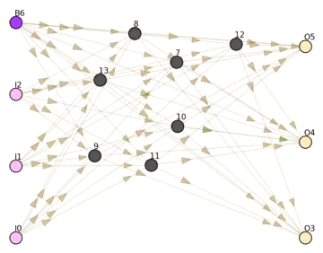
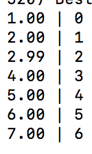

# Learning to count in Binary

## Objective
Make a Neural Network learn how to count. In the example below, the network receives a binary number of length 3 and computes the next number.

So for `010` the output must be `011`.
For `011` the output is `100`.

## Live evolution of the network

~~~
I0, I1, I2 - inputs
B6 - bias
O3, O4, O5 - outputs
~~~

## Result
(Left - output | Right - input)

